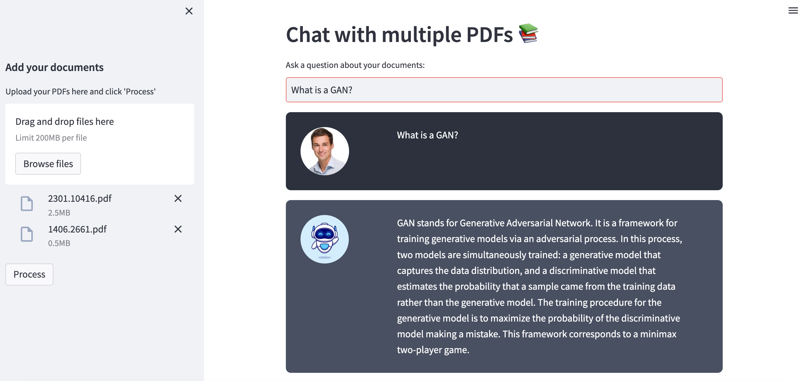

# PDF-Chatbot
Chatbot that ingests PDFs to create a tailored LLM solution

The goal of this project was to follow the following tutorial, but start my code from scratch as a learning opportunity, instead of forking and running the author's code. Much debugging was run to get the code to work in alignment with the tutorial and some changes were made to accommodate that (see YouTube link below).

From tutorial: https://www.youtube.com/watch?v=dXxQ0LR-3Hg

The finished product (tailored to my use case)

